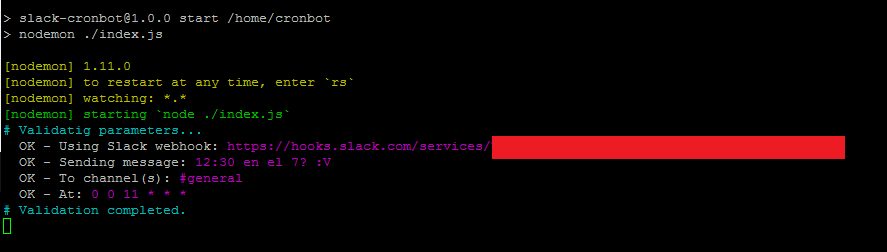

# Slack cronbot
Start a bot to send scheduled message to your slack channel.

## Before you start
Be sure to have a web hook installed at your slack subdomain. You'll need you'r own team's _**Webhook URL**_

For more information check: [Incoming Webhooks API](https://api.slack.com/incoming-webhooks)

## Getting started
You can start using this bot either as:  
1. Standalone NodeJS App
2. Heroku  
3. Docker Container

### Standalone NodeJS
1. Install dependencies
```
npm install
```
2. Create a json at `./configs/config.json` with the next data:
```
{
  "SLACK_HOOK_URL": "someUrl",
  "SLACK_MESSAGE": "Hello World!",
  "SLACK_CHANNEL": "#random",
  "CRON_TIME": "0 * * * * *"
}
```

3. Start your Bot!
```
npm start
```

### Heroku
1. Configure your Environment Variables. **(Check Environment references)**
2. Let It start!


### Docker Container
The local _**Dockerfile**_ is used at the [Docker Hub Official Registry](https://hub.docker.com/r/oscardhdz/slack-cronbot/).

Just run:

```
docker run -e NODE_ENV=production SLACK_HOOK_URL={yourSlackWebHookUrl} -e SLACK_MESSAGE={messageToBeSent} -e SLACK_CHANNEL={channelId(s)/Name(s)} -e CRON_TIME={yourCronTime} -v /etc/timezone:/etc/timezone -v /etc/localtime:/etc/localtime oscardhdz/slack-cronbot
```

You might want to be aware of container timezone issues. I reommend binding time paths between conatiner and host with:
```
-v /etc/timezone:/etc/timezone -v /etc/localtime:/etc/localtime
```

## Expected Output
If set up correctly, you should get an output like this (Preview available at Github):



## Environment References Table
| Variable       | Value                                                 | Description                                                                                                                                                     |
|----------------|-------------------------------------------------------|-----------------------------------------------------------------------------------------------------------------------------------------------------------------|
| NODE_ENV       | `development` OR `Any`                          | If not specified, Will set `development` by default and will try to read `./configs/config.json` file. Use anyother value to listen to Env var binds            |
| SLACK_HOOK_URL | Web Hook Url                                          | Your slack team incoming web hook. Check [Incoming Web Hook API](https://api.slack.com/incoming-webhooks) for more info.                                        |
| SLACK_MESSAGE  | `Text`                                                  | The message to be sent by this Bot                                                                                                                              |
| SLACK_CHANNEL  | `#ChannelName` OR `ChannelId` OR `Channels,separeted,by,commas` | A channel name with '#' char, or a channel Id (Beware channel name might change but Id wont). You can also specify 2  or more by separating each one with a coma |
| CRON_TIME      | Cron Format: `* * * * * *`                              | Cron time syntax. Check [npm Cron Ranges](https://www.npmjs.com/package/cron) for more detail. Sets each minute by default (`0 * * * * *`)                                                      |
